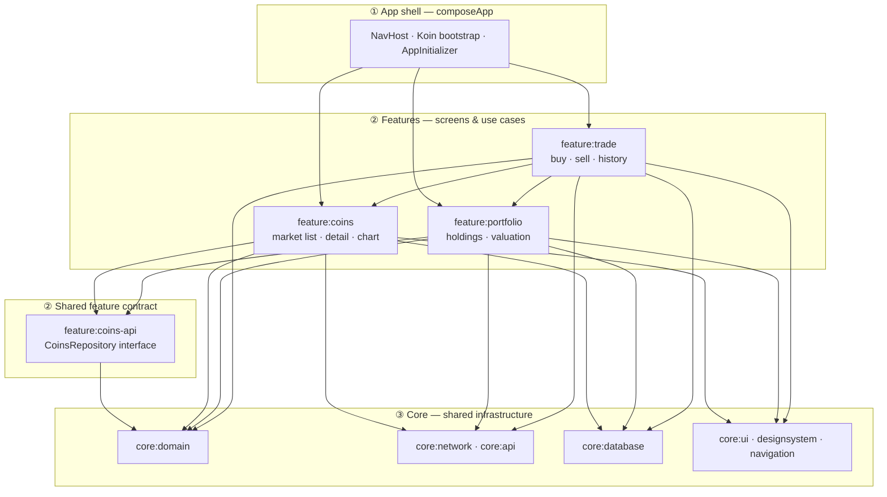
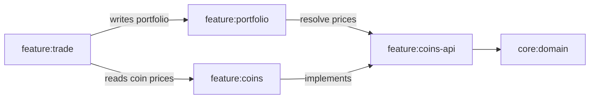
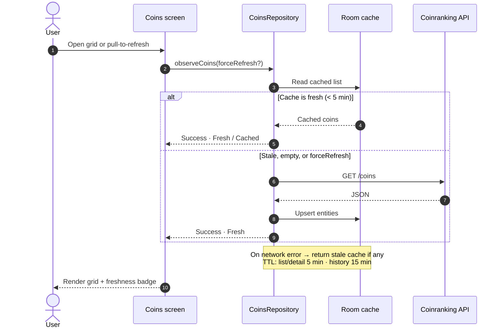
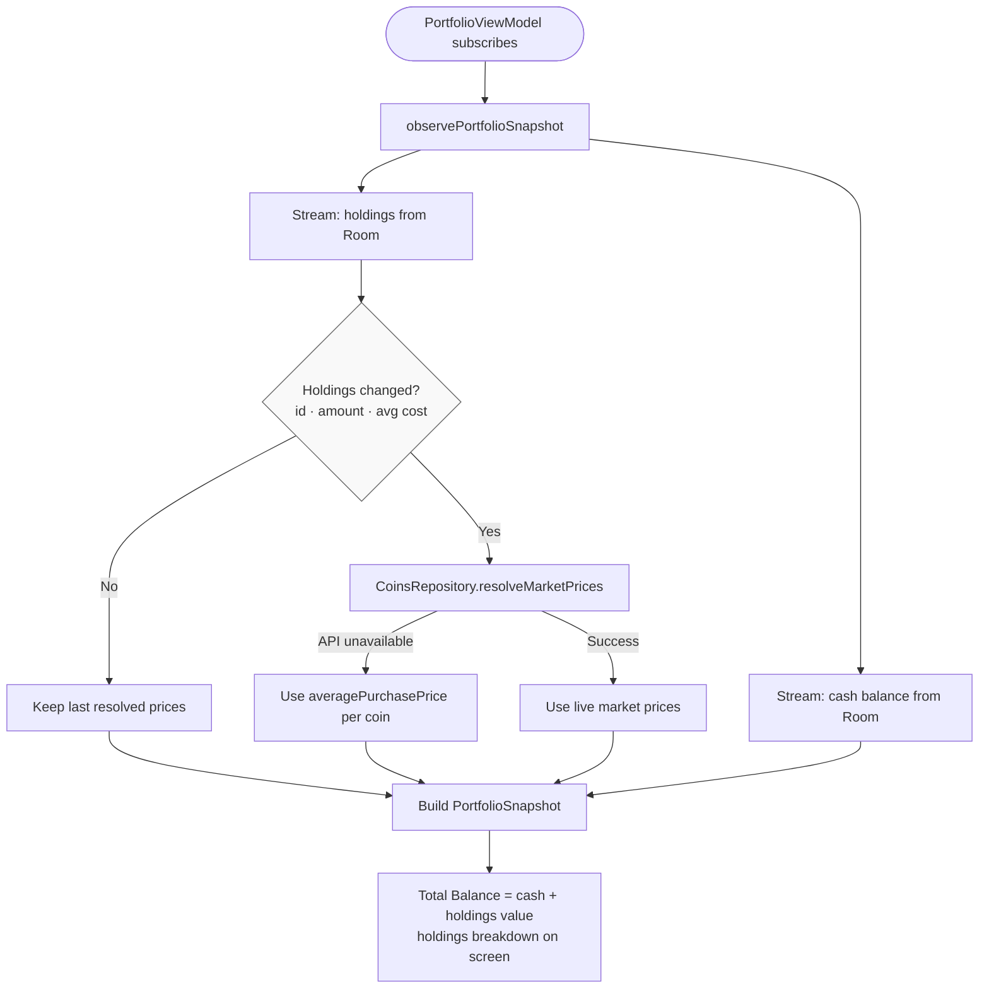
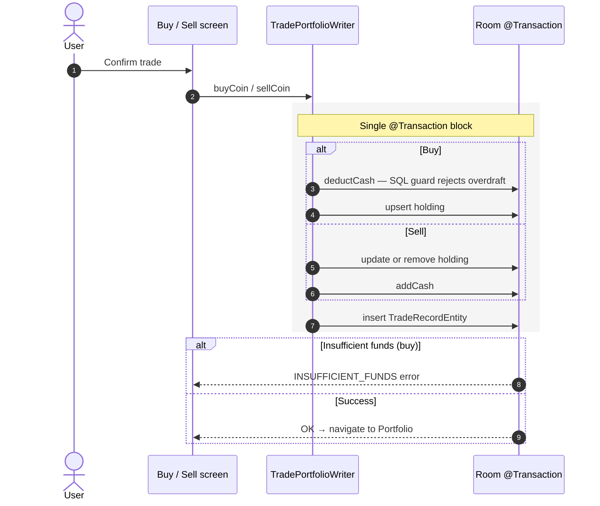
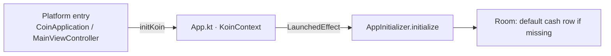

# CryptoNest

A **Kotlin Multiplatform (KMP)** sample app for managing a simulated crypto portfolio on **Android** and **iOS**. Built with **Compose Multiplatform**, it demonstrates modular Clean Architecture, offline-first networking, Room persistence, and testable domain logic—the kind of structure you would discuss in a senior mobile or KMP interview.

> **Scope** — Reference implementation for learning and technical evaluation. Not a regulated financial product. Do not use for real trading without security, compliance, and operational review.

---

## Table of contents

- [Features](#features)
- [Design principles](#design-principles)
- [Architecture](#architecture)
- [Key flows](#key-flows)
- [Tech stack](#tech-stack)
- [Project structure](#project-structure)
- [Prerequisites](#prerequisites)
- [Getting started](#getting-started)
- [Configuration](#configuration)
- [Running the app](#running-the-app)
- [Testing](#testing)
- [Known limitations](#known-limitations)
- [Troubleshooting](#troubleshooting)
- [Security](#security)
- [License & acknowledgements](#license--acknowledgements)

---

## Features

| Area | Description |
|------|-------------|
| **Portfolio** | Holdings, **Total Balance** (cash + market value), and breakdown (holdings vs cash) |
| **Market** | Coin grid with live prices from the [Coinranking API](https://coinranking.com/) |
| **Trade** | Simulated buy/sell against a local cash balance |
| **Trade history** | Persistent ledger (amount, price, timestamp) for every trade |
| **Charts** | Long-press a coin on the grid to load 24h price history |
| **Resilience** | Loading, empty, and error states with retry |
| **API errors** | Normalized remote failures (timeouts, rate limits, API messages) |
| **Offline-first** | Room cache with TTL, pull-to-refresh, and freshness indicators |

---

## Design principles

| Principle | How it shows up |
|-----------|-----------------|
| **Modular boundaries** | Feature modules depend on contracts (`feature:coins-api`), not on each other's internals |
| **Single write path** | Portfolio mutations go only through `TradePortfolioWriter` inside Room `@Transaction` blocks |
| **Separation of concerns** | `PortfolioHolding` (cost basis, units) vs `PortfolioCoinModel` (UI + market value) |
| **Cache-first reads** | `CoinsRepository` coordinates network + Room; UI observes `Flow`/`Result` |
| **Side effects at the edge** | Cash seeding runs in `AppInitializer` at startup—not in ViewModels |
| **Testability** | Shared fakes/fixtures in `core:testing`; DAO and repository tests cover critical paths |

---

## Architecture

The project follows **Clean Architecture** with Gradle modules aligned to [Google's modularization guidance](https://developer.android.com/topic/modularization) (Now in Android style).

Each feature module uses **data → domain → presentation** packages. Dependencies always point **inward** (UI → domain ← data). No feature module depends on `composeApp`.

### Layer overview

Three tiers. Arrows show **Gradle dependency direction** (who imports whom).



### How features connect

Only **cross-feature** links (everything else goes through core or `coins-api`).



| Rule | Meaning |
|------|---------|
| **Portfolio → coins-api** | Portfolio never imports `feature:coins` internals—only the public `CoinsRepository` contract |
| **Trade → portfolio** | All buy/sell mutations go through `TradePortfolioWriter` in the portfolio data layer |
| **Trade → coins** | Trade screens need live coin detail/prices from the market feature |

### Module responsibilities

| Module | Role |
|--------|------|
| **core:domain** | `Result`, `DataError`, shared models, cache policy |
| **core:network** | Ktor `HttpClient`, secrets interface, network DI |
| **core:database** | Room database, entities, DAOs, migrations, exported schemas |
| **core:api** | `SafeApiClient`, remote failure mapping |
| **core:ui** | Shared Compose components, formatters, strings |
| **core:designsystem** | Material 3 theme (`CoinTheme`) |
| **core:navigation** | Type-safe navigation routes |
| **core:testing** | Shared test fakes, fixtures, and coroutine rules (`testImplementation` only) |
| **feature:coins-api** | Public market contract (`CoinsRepository`, coin models) |
| **feature:coins** | Market list, detail, chart |
| **feature:portfolio** | Portfolio screen and repository |
| **feature:trade** | Buy/sell flows and trade history |
| **composeApp** | Application entry, platform secrets, Android UI tests |

Platform code (`androidMain` / `iosMain`) is limited to `expect`/`actual` boundaries: secrets, database builder, and system UI.

---

## Key flows

Runtime behavior in three diagrams. Read top-to-bottom / left-to-right in each.

### 1 · Market data (offline-first)

UI always reads through **`CoinsRepository`**. Network responses are cached in Room; failures fall back to the last snapshot.



| Data | TTL | Room entity |
|------|-----|-------------|
| Coin list & detail | 5 min | `CachedCoinEntity`, `CachedCoinDetailEntity` |
| Price history | 15 min | `CachedPriceHistoryEntity` |
| Trade records | Permanent | `TradeRecordEntity` |

### 2 · Portfolio valuation

**`observePortfolioSnapshot()`** merges holdings, live prices, and cash into one reactive stream.



Cash-only updates after a trade **skip** the price API (`distinctUntilChanged` on holdings).

### 3 · Trade execution (atomic write)

**`TradePortfolioWriter`** is the only production path that mutates holdings, cash, or the trade ledger.



### App bootstrap

On first launch, **`AppInitializer`** seeds `$10,000` cash via `PortfolioRepository.initUserBalance()`.



Koin starts on the platform; seeding runs from `App.kt`—not from ViewModels.

### Domain models (portfolio vs trade)

| Model | Layer | Role |
|-------|-------|------|
| **`PortfolioHolding`** | Domain / DB | Persisted units + average cost (no live price) |
| **`PortfolioCoinModel`** | Domain / UI | Holding + `marketValueFiat` + performance % |
| **`PortfolioSnapshot`** | Domain | Read model: coins, cash, `totalBalance` |
| **`TradePortfolioWriter`** | Data | Atomic buy/sell + ledger writes |

---

## Tech stack

| Category | Libraries |
|----------|-----------|
| UI | Compose Multiplatform 1.7, Material 3 |
| DI | Koin 4 |
| Networking | Ktor 3, Kotlinx Serialization |
| Persistence | Room 2.7 (KMP), SQLite bundled |
| Images | Coil 3 |
| Navigation | Navigation Compose (type-safe routes) |
| Concurrency | Kotlin Coroutines, `StateFlow` |
| Unit tests | kotlin-test, AssertK, Turbine, coroutines-test |
| UI tests (Android) | Compose UI Test, AndroidX Test |

**Targets:** Android API 24+ · iOS (x64, arm64, simulator arm64)  
**Toolchain:** JDK 17 · Kotlin 2.0.21 · Gradle 8.x · AGP 8.5

---

## Project structure

```
KMP-CryptoNest/
├── composeApp/                 # App shell, Koin bootstrap, AppInitializer, platform entry
├── core/
│   ├── domain/                 # Result, DataError, shared domain models
│   ├── network/                # Ktor client, AppSecrets
│   ├── database/               # Room DB, DAOs, migrations, schemas/
│   ├── api/                    # SafeApiClient, remote error mapping
│   ├── ui/                     # Shared Compose UI, formatters
│   ├── designsystem/           # Material 3 theme
│   ├── navigation/             # Type-safe routes
│   └── testing/                # Shared fakes & fixtures (test-only)
├── feature/
│   ├── coins-api/              # Public CoinsRepository contract
│   ├── coins/                  # Market list, detail, chart
│   ├── portfolio/              # Portfolio screen + repository
│   └── trade/                  # Buy/sell + trade history
├── iosApp/                     # Xcode wrapper
└── gradle/
```

---

## Prerequisites

| Tool | Version (tested) |
|------|------------------|
| JDK | 17 |
| Android Studio | Hedgehog or newer (KMP + Compose plugins) |
| Xcode | 15+ (macOS, for iOS) |
| Coinranking API key | [Developer dashboard](https://account.coinranking.com/dashboard/api) |

---

## Getting started

```bash
git clone https://github.com/<your-org>/KMP-CryptoNest.git
cd KMP-CryptoNest
```

Configure API credentials (see [Configuration](#configuration)) **before** the first Gradle sync.

---

## Configuration

Secrets are never committed. Use platform-local files.

### Android — `local.properties` (project root)

Gradle reads this file automatically (git-ignored):

```properties
API_KEY=your_coinranking_api_key
BASE_URL=https://api.coinranking.com/v2/
```

Use a **trailing slash** on `BASE_URL`. Values are injected into `BuildConfig` and consumed via `AppSecrets`.

### iOS — `iosApp/iosApp/Secrets.plist`

```xml
<?xml version="1.0" encoding="UTF-8"?>
<!DOCTYPE plist PUBLIC "-//Apple//DTD PLIST 1.0//EN" "http://www.apple.com/DTDs/PropertyList-1.0.dtd">
<plist version="1.0">
<dict>
    <key>API_KEY</key>
    <string>your_coinranking_api_key</string>
    <key>BASE_URL</key>
    <string>https://api.coinranking.com/v2/</string>
</dict>
</plist>
```

Ensure `Secrets.plist` is git-ignored.

---

## Running the app

### Android

1. Open the project in Android Studio.
2. Select the **composeApp** debug configuration.
3. Run on an emulator or device.

```bash
./gradlew :composeApp:assembleDebug
```

### iOS

1. Build the shared framework:

   ```bash
   ./gradlew :composeApp:linkDebugFrameworkIosSimulatorArm64
   ```

   Use the target that matches your machine/simulator (`IosArm64`, `IosX64`, etc.).

2. Open `iosApp/iosApp.xcodeproj` in Xcode.
3. Run on a simulator or device.

---

## Testing

### Unit tests

Run per module:

```bash
./gradlew :core:api:testDebugUnitTest
./gradlew :feature:coins:testDebugUnitTest
./gradlew :feature:portfolio:testDebugUnitTest
./gradlew :feature:trade:testDebugUnitTest
```

Run the main suite in one command:

```bash
./gradlew :composeApp:assembleDebug \
  :core:api:testDebugUnitTest \
  :feature:coins:testDebugUnitTest \
  :feature:portfolio:testDebugUnitTest \
  :feature:trade:testDebugUnitTest
```

**Coverage highlights**

| Area | Tests |
|------|-------|
| Market cache | `CoinsRepositoryImplTest` — cache-first emit, stale refresh |
| Portfolio pipeline | `PortfolioRepositoryImplTest` — no price re-resolve on cash-only change |
| Holdings equality | `PortfolioHoldingsEqualityTest` — `distinctUntilChanged` predicate |
| Trade domain | `BuyCoinUseCaseTest`, `SellCoinUseCaseTest` |
| Atomic DB writes | `PortfolioTransactionDaoTest` (instrumented) |

### Instrumented tests (Android)

Requires a connected emulator or device:

```bash
./gradlew :composeApp:connectedDebugAndroidTest
./gradlew :core:database:connectedDebugAndroidTest
```

Compose UI tests use stable `testTag`s from `CoinTestTags` (coin grid, chart dialog, trade history).

### Test utilities (`core:testing`)

| Package | Contents |
|---------|----------|
| `test/fixture/` | `TestCoins`, `TestPortfolio`, `TestTrades` |
| `test/fake/` | Fake repositories, data sources, `FakeTradePortfolioWriter` |
| `test/rule/` | `MainCoroutineRule` for ViewModel tests |

Feature modules consume this via `testImplementation(projects.core.testing)`.

---

## Known limitations

This sample prioritizes clarity and interview-grade architecture over production completeness:

| Topic | Current behavior |
|-------|------------------|
| **Concurrency** | Buy pre-checks balance outside the DB transaction; SQL guard on buy prevents overdraft at write time. Sell validates holdings in the use case only. |
| **Bootstrap timing** | `AppInitializer` runs asynchronously; UI may briefly show the default balance before the Room row exists. |
| **Financial accuracy** | Simulated trades; no slippage, fees, or real exchange integration. |
| **Security** | No certificate pinning, backend proxy, or hardware-backed secret storage. |
| **Scope** | Single-user local ledger; no auth, sync, or multi-device support. |

These are intentional for a reference app and are reasonable discussion points in a system design interview.

---

## Troubleshooting

| Symptom | Likely cause | Action |
|---------|--------------|--------|
| Empty coin list | Missing API key or DTO mismatch | Check Logcat tag `CryptoNest/Network`; verify `API_KEY` and `BASE_URL` |
| `Property 'API_KEY' not found` | Missing `local.properties` | Create the file at the project root (Android) |
| Chart shows API error | Rate limit (HTTP 429) | Wait or upgrade your Coinranking plan; error is surfaced in UI |
| Request timeout | Slow network | Retries and timeouts live in `HttpClientFactory` |
| UI tests fail to launch | Wrong activity / process | Instrumented tests use `ComposeHostActivity` in the debug manifest |
| iOS build: `expect`/`actual` errors | Source set hierarchy | Ensure `applyDefaultHierarchyTemplate()` is enabled in `composeApp/build.gradle.kts` |

---

## Security

- Never commit `local.properties`, `Secrets.plist`, or API keys.
- Market data is fetched over HTTPS; portfolio data is stored **locally only**.
- Treat this repository as **non-production** from a threat-modeling perspective.
- Production hardening would require: backend proxy for secrets, certificate pinning, ProGuard/R8, dependency auditing, and regulated-finance compliance review.

---

## License & acknowledgements

**Data disclaimer** — Prices and percentage changes come from Coinranking for demonstration. Simulated trades update a local database only; they do not represent blockchain or exchange transactions.

**Acknowledgements**

- Market data: [Coinranking API](https://coinranking.com/)
- [Kotlin Multiplatform](https://kotlinlang.org/docs/multiplatform.html)
- [Compose Multiplatform](https://www.jetbrains.com/compose-multiplatform/)
