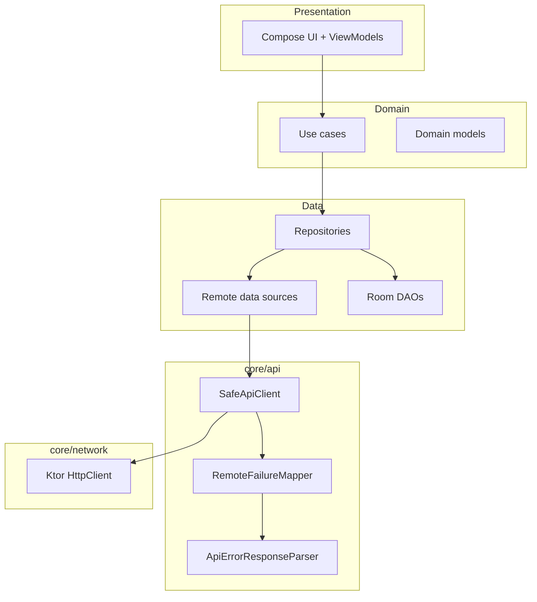

# CryptoNest

Cross-platform cryptocurrency portfolio sample built with **Kotlin Multiplatform (KMP)** and **Compose Multiplatform**.  
A single shared codebase powers **Android** and **iOS**, demonstrating production-oriented patterns: layered architecture, modular API error handling, local persistence, and automated testing.

> **Scope** — This repository is a reference implementation for learning and technical interviews. It is not a regulated financial product and must not be used for real trading without a full security, compliance, and operational review.

---

## Table of contents

- [Features](#features)
- [Architecture](#architecture)
- [Tech stack](#tech-stack)
- [Repository layout](#repository-layout)
- [Prerequisites](#prerequisites)
- [Getting started](#getting-started)
- [Configuration](#configuration)
- [Running the app](#running-the-app)
- [Testing](#testing)
- [Troubleshooting](#troubleshooting)
- [Security notes](#security-notes)

---

## Features

| Area | Description |
|------|-------------|
| **Portfolio** | View holdings, total value, and navigate to buy/sell flows |
| **Market browse** | Coin grid with live prices from [Coinranking API](https://coinranking.com/) |
| **Trade** | Simulated buy/sell against a local cash balance (Room) |
| **24h chart** | Long-press a coin to load price history in a dialog |
| **Resilient UI** | Loading, empty, and error states with retry on the coins list |
| **API errors** | Normalised remote failures (timeouts, rate limits, API messages) |

---

## Architecture

The app follows **Clean Architecture** with feature modules (`coins`, `portfolio`, `trade`) and shared infrastructure under `core`.



### Layer responsibilities

| Layer | Responsibility |
|-------|----------------|
| **Presentation** | Compose screens, `StateFlow` UI state, navigation |
| **Domain** | Use cases, `Result<T, E>`, business rules (no Android/iOS APIs) |
| **Data** | DTO mapping, repositories, Ktor + Room implementations |
| **core/api** | HTTP safety, Coinranking error parsing, user-facing error mapping |
| **core** | Navigation routes, shared `DataError`, DI modules, theme |

### Dependency rule

Dependencies point **inward**: `presentation → domain ← data`. Platform code (`androidMain`, `iosMain`) only provides `expect/actual` boundaries (secrets, database factory, system UI).

---

## Tech stack

| Category | Libraries |
|----------|-----------|
| UI | Compose Multiplatform, Material 3 |
| DI | Koin 4 |
| Networking | Ktor 3, Kotlinx Serialization |
| Local storage | Room 2.7 (KMP), SQLite bundled |
| Images | Coil 3 |
| Navigation | Navigation Compose (type-safe routes) |
| Async | Kotlin Coroutines, `StateFlow` |
| Unit tests | kotlin-test, AssertK, Turbine, coroutines-test |
| UI tests (Android) | Compose UI Test, AndroidX Test |

**Targets:** Android API 24+, iOS (X64 / Arm64 / Simulator Arm64)  
**Toolchain:** JDK 17, Kotlin 2.0.21, Gradle 8.x

---

## Repository layout

```
KMP-CryptoNest/
├── composeApp/                    # Shared KMP application module
│   ├── src/commonMain/            # Shared Kotlin + Compose
│   │   └── kotlin/.../first/
│   │       ├── core/              # api, network, database, navigation, presentation
│   │       ├── coins/             # Feature: market list + chart
│   │       ├── portfolio/         # Feature: holdings
│   │       ├── trade/             # Feature: buy / sell
│   │       ├── theme/
│   │       └── di/
│   ├── src/commonTest/            # Shared unit tests + fakes/fixtures
│   ├── src/androidMain/
│   ├── src/androidUnitTest/
│   ├── src/androidInstrumentedTest/
│   ├── src/iosMain/
│   └── schemas/                   # Room schema exports
├── iosApp/                        # Xcode wrapper for iOS
├── gradle/
└── README.md
```

---

## Prerequisites

Install and verify the following before building:

| Tool | Version (tested) |
|------|------------------|
| JDK | 17 |
| Android Studio | Hedgehog or newer (KMP + Compose plugins) |
| Xcode | 15+ (macOS only, for iOS) |
| Coinranking API key | [Developer dashboard](https://account.coinranking.com/dashboard/api) |

---

## Getting started

```bash
git clone https://github.com/<your-org>/KMP-CryptoNest.git
cd KMP-CryptoNest
```

Configure credentials (see [Configuration](#configuration)) **before** the first Gradle sync.

---

## Configuration

Secrets are **never** committed. Use local files per platform.

### Android — `local.properties` (project root)

Create `local.properties` (Gradle reads it automatically; the file is git-ignored):

```properties
API_KEY=your_coinranking_api_key
BASE_URL=https://api.coinranking.com/v2/
```

> Use a **trailing slash** on `BASE_URL`. Values are injected into `BuildConfig` and read via `AppSecrets`.

### iOS — `iosApp/iosApp/Secrets.plist`

```xml
<?xml version="1.0" encoding="UTF-8"?>
<!DOCTYPE plist PUBLIC "-//Apple//DTD PLIST 1.0//EN" "http://www.apple.com/DTDs/PropertyList-1.0.dtd">
<plist version="1.0">
<dict>
    <key>API_KEY</key>
    <string>your_coinranking_api_key</string>
    <key>BASE_URL</key>
    <string>https://api.coinranking.com/v2/</string>
</dict>
</plist>
```

Add `Secrets.plist` to `.gitignore` if it is not already excluded.

---

## Running the app

### Android

1. Open the project in Android Studio.
2. Select the **composeApp** run configuration (debug).
3. Run on an emulator or device.

```bash
./gradlew :composeApp:assembleDebug
```

### iOS

1. Build the shared framework: `./gradlew :composeApp:linkDebugFrameworkIosSimulatorArm64` (or the appropriate target).
2. Open `iosApp/iosApp.xcodeproj` in Xcode.
3. Run on a simulator or device.

---

## Testing

### Unit tests (common + Android JVM)

```bash
./gradlew :composeApp:testDebugUnitTest
```

Coverage includes domain use cases, mappers, `SafeApiClient` / `RemoteFailureMapper`, and ViewModels (with fakes in `commonTest`).

### Instrumented UI tests (Android)

Requires a connected emulator or device:

```bash
./gradlew :composeApp:connectedDebugAndroidTest
```

UI tests cover coin grid items and the price-chart dialog (`CoinTestTags` for stable selectors).

### Test support code

| Path | Purpose |
|------|---------|
| `commonTest/.../test/fixture/` | Reusable domain/DTO fixtures |
| `commonTest/.../test/fake/` | Fake repositories and remote data sources |
| `commonTest/.../test/rule/` | `MainCoroutineRule` for ViewModel tests |

---

## Troubleshooting

| Symptom | Likely cause | Action |
|---------|--------------|--------|
| Empty coin list | DTO / API mismatch or missing key | Check Logcat tag `CryptoNest/Network`; verify `API_KEY` and `BASE_URL` |
| `Property 'API_KEY' not found` | Missing `local.properties` | Create file at repo root (Android) |
| Chart shows API message | Rate limit (HTTP 429) | Wait or upgrade Coinranking plan; message is surfaced in UI |
| Request timeout | Slow network | Retries are configured in `HttpClientFactory`; increase timeouts if needed |
| UI tests fail to launch | Wrong activity / process | Instrumented tests use `ComposeHostActivity` in the debug manifest |

---

## Security notes

- Do **not** commit `local.properties`, `Secrets.plist`, or API keys.
- Market data is fetched over HTTPS; portfolio balances are stored **locally only**.
- Biometric APIs are wired on Android for future use; treat this sample as **non-production** from a threat-modelling perspective.
- Before any production deployment: certificate pinning, secret management (e.g. backend proxy), ProGuard/R8, and dependency auditing would be required.

---

## Data disclaimer

Prices and percentage changes are supplied by Coinranking for demonstration. Simulated trades update a local database only and do not represent real blockchain or exchange transactions.

---

## Acknowledgements

- Market data: [Coinranking API](https://coinranking.com/)
- Built with [Kotlin Multiplatform](https://kotlinlang.org/docs/multiplatform.html) and [Compose Multiplatform](https://www.jetbrains.com/compose-multiplatform/)
